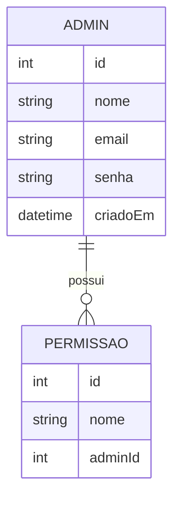
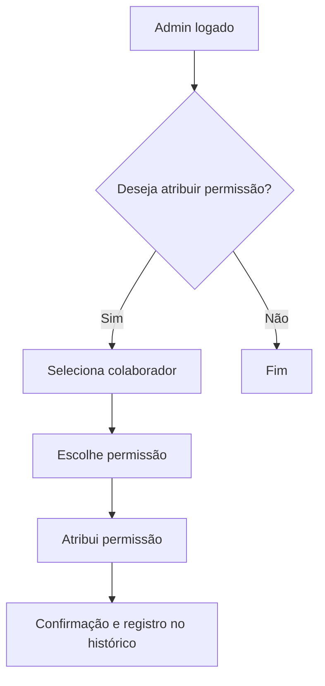

# Análise e Modelagem de Sistemas

Este documento apresenta a análise e modelagem do sistema Serralheria API, seguindo práticas profissionais de Engenharia de Software. O objetivo é garantir clareza, rastreabilidade e alinhamento entre requisitos, regras de negócio, estrutura de dados e fluxos do sistema.

---

## 1. Levantamento e Especificação de Requisitos

### 1.1 Requisitos Funcionais
- O sistema deve permitir o cadastro, edição, remoção e listagem de administradores.
- O sistema deve possibilitar a definição e atribuição de permissões (roles) para cada usuário.
- O sistema deve controlar o acesso a domínios como clientes, pedidos, relatórios, etc.
- O sistema deve registrar o histórico de alterações de permissões.

### 1.2 Requisitos Não Funcionais
- Segurança: criptografia de senhas, autenticação JWT, proteção de endpoints sensíveis.
- Usabilidade: interfaces intuitivas e responsivas para o painel administrativo.
- Escalabilidade: arquitetura modular para suportar novos domínios e permissões.

### 1.3 Restrições e Premissas
- O sistema será desenvolvido em Node.js, TypeScript e Express.
- O banco de dados será relacional, gerenciado via Prisma ORM.

---

## 2. Casos de Uso (Exemplos)
- **UC01:** Admin cadastra novo colaborador.
- **UC02:** Admin atribui/remover permissão de um colaborador.
- **UC03:** Colaborador acessa funcionalidade permitida.
- **UC04:** Admin consulta histórico de permissões.

## 3. Modelagem de Dados (Entidades e Relacionamentos)

## 4. Modelagem de Processos (Fluxo de Permissões)

## 5. Modelagem de Telas (Wireframe simplificado)

- Tela: Listagem de administradores
- Tela: Cadastro/edição de admin
- Tela: Atribuição de permissões (dropdown de permissões, lista de colaboradores)
- Tela: Histórico de permissões

## 6. Documentação e Validação

> Este documento serve como referência para análise e modelagem do painel administrativo e pode ser expandido para outros domínios do sistema.
## Observações

