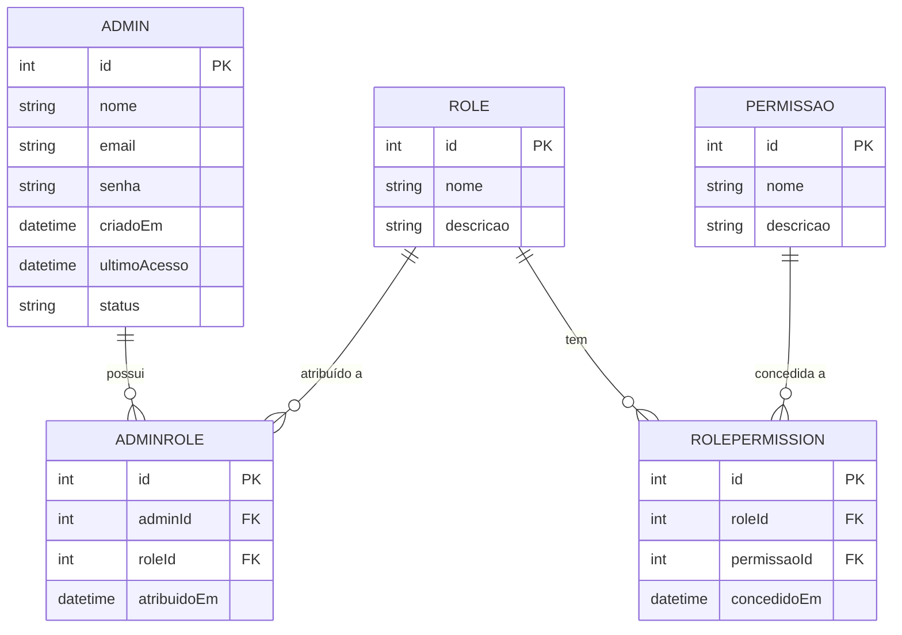
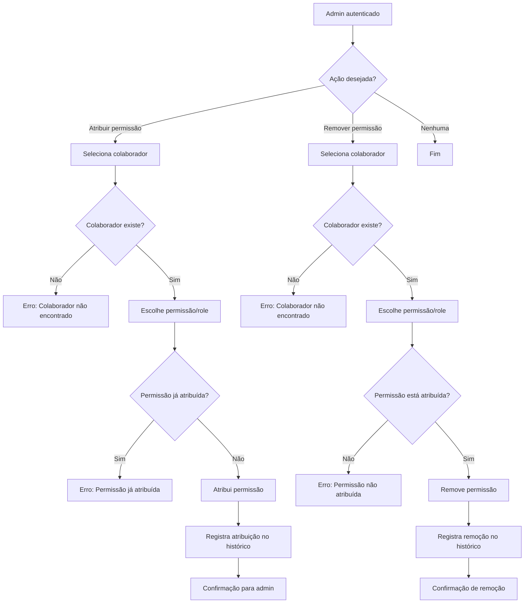

## Sumário

1. Contexto de Negócio
2. Requisitos
3. Casos de Uso
4. Modelagem de Dados
5. Processos
6. Telas e UX/UI
7. API (REST)
8. Testes e Validação
9. Estratégias de Evolução
10. Compliance e Segurança
11. Referências

---

# 1. Contexto de Negócio

O sistema Serralheria API visa digitalizar e profissionalizar a gestão de uma serralheria, centralizando operações administrativas, controle de permissões, cadastro de clientes, pedidos, relatórios e auditoria. O foco é garantir segurança, rastreabilidade, agilidade e escalabilidade, preparando o sistema para crescimento e possível migração para SaaS.

---

# 2. Requisitos

## 2.1 Funcionais
- [Admin] Cadastro, edição, remoção e listagem de administradores.
- [Admin] Definição e atribuição de papéis (roles) e permissões.
- [Cliente] Cadastro, edição, remoção e listagem de clientes.
- [Pedido] Gerenciamento de pedidos, status, histórico e notificações.
- [Relatórios] Geração e consulta de relatórios gerenciais.
- [Auditoria] Registro e rastreabilidade de todas alterações críticas.

## 2.2 Não Funcionais
- Segurança: criptografia de senhas, autenticação JWT, proteção de endpoints sensíveis, conformidade LGPD.
- Usabilidade: interfaces intuitivas, responsivas e acessíveis.
- Performance: respostas rápidas, paginadas e escaláveis.
- Disponibilidade: tolerância a falhas, backup automático.
- Escalabilidade: arquitetura modular, RBAC expansível, pronto para multi-tenancy.

## 2.3 Restrições e Premissas
- Stack: Node.js, TypeScript, Express, Prisma ORM.
- Banco relacional (PostgreSQL recomendado).
- Integração futura com serviços externos (email, logs, monitoramento).

---

# 3. Casos de Uso

## Exemplos
- **UC01:** Admin cadastra novo colaborador (pré-condição: admin autenticado; pós-condição: colaborador registrado).
- **UC02:** Admin atribui/remove permissão de colaborador (pré-condição: admin autenticado; pós-condição: permissão atualizada).
- **UC03:** Colaborador acessa funcionalidade permitida (pré-condição: permissão atribuída; pós-condição: ação realizada).
- **UC04:** Admin consulta histórico de permissões (pré-condição: admin autenticado; pós-condição: histórico exibido).

### Diagrama de Casos de Uso (Mermaid)
```mermaid
%% Diagrama simplificado
actor Admin
actor Colaborador
Admin --> (Cadastrar colaborador)
Admin --> (Atribuir/remover permissão)
Admin --> (Consultar histórico)
Colaborador --> (Acessar funcionalidade)
```

### Fluxos Alternativos e Respostas de Erro
- Email já cadastrado: 400 Bad Request `{ "error": "Email já cadastrado." }`
- Colaborador não encontrado: 404 Not Found `{ "error": "Colaborador não encontrado." }`
- Permissão insuficiente: 403 Forbidden `{ "error": "Permissão insuficiente." }`
- Nenhum histórico encontrado: 404 Not Found `{ "error": "Nenhum histórico encontrado." }`

### Validações e Regras de Negócio
- Email único e válido.
- Senha forte (mín. 8 caracteres, maiúscula, minúscula, número).
- Apenas admins autenticados podem criar, editar ou remover outros admins.
- Não é permitido remover o próprio usuário autenticado.

---

# 4. Modelagem de Dados

### 4.1 Papéis Organizacionais e Permissões (RBAC Avançado)
...existing code...enum StatusAdmin {
  ATIVO
  INATIVO
  BLOQUEADO
}

model Admin {
  id            Int           @id @default(autoincrement())
  nome          String
  email         String        @unique
  senha         String
  criadoEm      DateTime      @default(now())
  ultimoAcesso  DateTime?
  status        StatusAdmin   @default(ATIVO)
  roles         AdminRole[]
  createdBy     Int?
  updatedBy     Int?
  updatedAt     DateTime?
}

# Análise e Modelagem de Sistemas — Serralheria API

Este documento detalha a análise e modelagem do sistema Serralheria API, com foco em práticas profissionais de Engenharia de Software, rastreabilidade, versionamento e integração real com o Prisma ORM. O objetivo é garantir que requisitos, regras de negócio, estrutura de dados e fluxos estejam totalmente alinhados à implementação, facilitando manutenção, auditoria e evolução do sistema.

---


## 1. Levantamento e Especificação de Requisitos


### 1.1 Requisitos Funcionais
- Cadastro, edição, remoção e listagem de administradores.
- Definição e atribuição de papéis (roles) e permissões para cada usuário.
- Controle de acesso a múltiplos domínios (clientes, pedidos, relatórios, etc.).
- Registro e rastreabilidade do histórico de alterações de permissões (auditoria).


### 1.2 Requisitos Não Funcionais
- Segurança: criptografia de senhas, autenticação JWT, proteção de endpoints sensíveis.
- Usabilidade: interfaces intuitivas e responsivas para o painel administrativo.
- Escalabilidade: arquitetura modular e modelo RBAC expansível para novos domínios/permissões.


### 1.3 Restrições e Premissas
- Stack: Node.js, TypeScript, Express.
- Banco de dados relacional, gerenciado via Prisma ORM.

---


## 2. Casos de Uso (Exemplos)
- **UC01:** Admin cadastra novo colaborador.
- **UC02:** Admin atribui/remove permissão de um colaborador.
- **UC03:** Colaborador acessa funcionalidade permitida.
- **UC04:** Admin consulta histórico de permissões.


### Fluxos Alternativos e Respostas de Erro (Admin)

- **UC01 - Fluxo alternativo:**
    - Se o email informado já estiver cadastrado, o sistema retorna:
      - Status: 400 Bad Request
      - Body: `{ "error": "Email já cadastrado." }`
- **UC02 - Fluxo alternativo:**
    - Se o colaborador não existir, retorna:
      - Status: 404 Not Found
      - Body: `{ "error": "Colaborador não encontrado." }`
- **UC03 - Fluxo alternativo:**
    - Se o colaborador tentar acessar funcionalidade sem permissão:
      - Status: 403 Forbidden
      - Body: `{ "error": "Permissão insuficiente." }`
- **UC04 - Fluxo alternativo:**
    - Se não houver histórico para o admin:
      - Status: 404 Not Found
      - Body: `{ "error": "Nenhum histórico encontrado." }`


### Validações e Regras de Negócio (Admin)
- Email único e válido.
- Senha forte (mín. 8 caracteres, maiúscula, minúscula, número).
- Apenas admins autenticados podem criar, editar ou remover outros admins.
- Não é permitido remover o próprio usuário autenticado.


## 3. Modelagem de Dados (Entidades e Relacionamentos)
### Papéis Organizacionais e Permissões (RBAC Avançado)


| Nível | Papel         | Permissões-Chave |
|-------|---------------|-----------------|
| 🏆    | CEO           | FULL_ACCESS, GERENCIAR_DEPARTAMENTO, APROVAR_ORCAMENTOS, VISUALIZAR_RELATORIOS, GERENCIAR_EQUIPE, CONTROLAR_PEDIDOS, CONTROLAR_ESTOQUE, GERENCIAR_COLABORADORES, ATUALIZAR_STATUS, VISUALIZAR_MATERIAIS |
| 💼    | Diretor       | GERENCIAR_DEPARTAMENTO, APROVAR_ORCAMENTOS, VISUALIZAR_RELATORIOS |
| 🧠    | Gerente       | GERENCIAR_EQUIPE, CONTROLAR_PEDIDOS, CONTROLAR_ESTOQUE |
| 🧰    | Encarregado   | GERENCIAR_COLABORADORES, ATUALIZAR_STATUS, VISUALIZAR_MATERIAIS |
| 👷    | Colaborador   | VISUALIZAR_MATERIAIS |


**Permissões detalhadas:**
- `FULL_ACCESS`: Acesso total ao sistema.
- `GERENCIAR_DEPARTAMENTO`: Gerenciar departamentos e responsáveis.
- `APROVAR_ORCAMENTOS`: Aprovar/rejeitar orçamentos.
- `VISUALIZAR_RELATORIOS`: Acessar relatórios gerenciais.
- `GERENCIAR_EQUIPE`: Supervisionar equipes e metas.
- `CONTROLAR_PEDIDOS`: Gerenciar pedidos.
- `CONTROLAR_ESTOQUE`: Gerenciar estoque de materiais.
- `GERENCIAR_COLABORADORES`: Supervisionar colaboradores.
- `ATUALIZAR_STATUS`: Atualizar status de processos.
- `VISUALIZAR_MATERIAIS`: Consultar materiais.

> O modelo RBAC é expansível e auditável, permitindo delegação e controle granular. Toda atribuição/remoção é registrada para rastreabilidade.




#### Exemplo de Modelagem Prisma (prático)

```prisma
model Admin {
  id            Int           @id @default(autoincrement())
  nome          String
  email         String        @unique
  senha         String
  criadoEm      DateTime      @default(now())
  ultimoAcesso  DateTime?
  status        String
  roles         AdminRole[]
}

model Role {
  id          Int             @id @default(autoincrement())
  nome        String          @unique
  descricao   String?
  admins      AdminRole[]
  permissoes  RolePermission[]
}

model Permissao {
  id          Int             @id @default(autoincrement())
  nome        String          @unique
  descricao   String?
  roles       RolePermission[]
}

model AdminRole {
  id         Int       @id @default(autoincrement())
  admin      Admin     @relation(fields: [adminId], references: [id])
  adminId    Int
  role       Role      @relation(fields: [roleId], references: [id])
  roleId     Int
  atribuidoEm DateTime @default(now())
}

model RolePermission {
  id           Int         @id @default(autoincrement())
  role         Role        @relation(fields: [roleId], references: [id])
  roleId       Int
  permissao    Permissao   @relation(fields: [permissaoId], references: [id])
  permissaoId  Int
  concedidoEm  DateTime    @default(now())
}
```


## 4. Modelagem de Processos (Fluxo de Permissões)





**Validações e Fluxos Alternativos:**
- Colaborador inexistente: erro 404.
- Permissão já atribuída: erro 400.
- Permissão não atribuída ao remover: erro 400.
- Toda atribuição/remoção é registrada no histórico (auditoria).
- Apenas admins autenticados podem operar.


## 5. Modelagem de Telas (Wireframe simplificado)
- Listagem de administradores
- Cadastro/edição de admin
- Atribuição de permissões (dropdown de permissões, lista de colaboradores)
- Histórico de permissões


## 6. Documentação e Validação

> Este documento serve como referência viva para análise, modelagem e implementação do painel administrativo, e pode ser expandido para outros domínios do sistema conforme a evolução do projeto.

---

**Integração com Prisma:**
O modelo RBAC apresentado está pronto para ser implementado via Prisma ORM, garantindo versionamento, rastreabilidade e fácil manutenção. Consulte o exemplo prático de modelagem Prisma na documentação de apoio.


