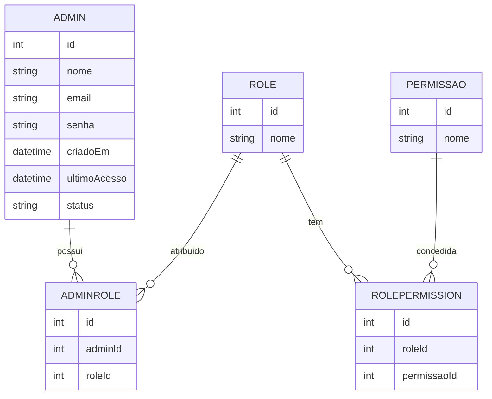
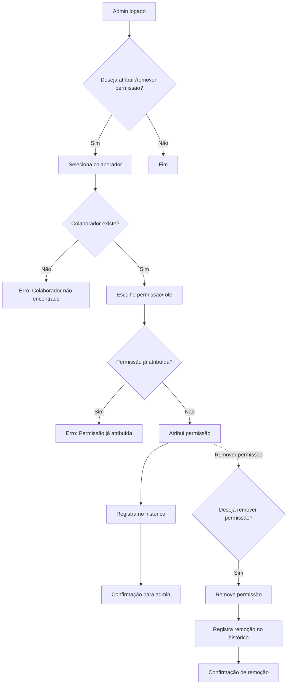

# Análise e Modelagem de Sistemas

Este documento apresenta a análise e modelagem do sistema Serralheria API, seguindo práticas profissionais de Engenharia de Software. O objetivo é garantir clareza, rastreabilidade e alinhamento entre requisitos, regras de negócio, estrutura de dados e fluxos do sistema.

---

## 1. Levantamento e Especificação de Requisitos

### 1.1 Requisitos Funcionais
- O sistema deve permitir o cadastro, edição, remoção e listagem de administradores.
- O sistema deve possibilitar a definição e atribuição de permissões (roles) para cada usuário.
- O sistema deve controlar o acesso a domínios como clientes, pedidos, relatórios, etc.
- O sistema deve registrar o histórico de alterações de permissões.

### 1.2 Requisitos Não Funcionais
- Segurança: criptografia de senhas, autenticação JWT, proteção de endpoints sensíveis.
- Usabilidade: interfaces intuitivas e responsivas para o painel administrativo.
- Escalabilidade: arquitetura modular para suportar novos domínios e permissões.

### 1.3 Restrições e Premissas
- O sistema será desenvolvido em Node.js, TypeScript e Express.
- O banco de dados será relacional, gerenciado via Prisma ORM.

---

## 2. Casos de Uso (Exemplos)
- **UC01:** Admin cadastra novo colaborador.
- **UC02:** Admin atribui/remover permissão de um colaborador.
- **UC03:** Colaborador acessa funcionalidade permitida.
- **UC04:** Admin consulta histórico de permissões.

### Fluxos Alternativos e Respostas de Erro (Admin)

- **UC01 - Fluxo alternativo:**
    - Se o email informado já estiver cadastrado, o sistema retorna:
      - Status: 400 Bad Request
      - Body: `{ "error": "Email já cadastrado." }`
- **UC02 - Fluxo alternativo:**
    - Se o colaborador não existir, retorna:
      - Status: 404 Not Found
      - Body: `{ "error": "Colaborador não encontrado." }`
- **UC03 - Fluxo alternativo:**
    - Se o colaborador tentar acessar funcionalidade sem permissão:
      - Status: 403 Forbidden
      - Body: `{ "error": "Permissão insuficiente." }`
- **UC04 - Fluxo alternativo:**
    - Se não houver histórico para o admin:
      - Status: 404 Not Found
      - Body: `{ "error": "Nenhum histórico encontrado." }`

### Validações e Regras de Negócio (Admin)

- Email deve ser único e válido.
- Senha deve ter no mínimo 8 caracteres, incluindo letra maiúscula, minúscula e número.
- Apenas administradores autenticados podem criar, editar ou remover outros admins.
- Não é permitido remover o próprio usuário autenticado.

## 3. Modelagem de Dados (Entidades e Relacionamentos)
### Papéis Organizacionais e Permissões (RBAC)

| Nível | Papel         | Descrição                                                                 | Permissões Principais                                 |
|-------|---------------|---------------------------------------------------------------------------|------------------------------------------------------|
| 🏆    | CEO           | Controle total do sistema. Define políticas, acessos e aprovações globais. | FULL_ACCESS (acesso a todos os módulos e permissões) |
| 💼    | Diretor       | Supervisiona departamentos (Financeiro, Produção, Comercial). Pode criar gerentes e revisar relatórios. | GERENCIAR_DEPARTAMENTO, APROVAR_ORCAMENTOS, VISUALIZAR_RELATORIOS |
| 🧠    | Gerente       | Coordena operações do setor e supervisiona equipes.                        | GERENCIAR_EQUIPE, CONTROLAR_PEDIDOS, CONTROLAR_ESTOQUE |
| 🧰    | Encarregado   | Supervisiona execução de tarefas e controle de materiais.                  | GERENCIAR_COLABORADORES, ATUALIZAR_STATUS, VISUALIZAR_MATERIAIS |
| 👷    | Colaborador   | Executa tarefas operacionais com acesso restrito ao seu escopo.            | -                                                    |

> As permissões podem ser expandidas conforme a evolução do sistema. Cada papel pode agregar múltiplas permissões, e a hierarquia permite delegação e controle granular.

## 4. Modelagem de Processos (Fluxo de Permissões)

**Validações e Fluxos Alternativos:**
- Se o colaborador não existir, retorna erro 404.
- Se a permissão já estiver atribuída, retorna erro 400.
- Se tentar remover permissão não existente, retorna erro 400.
- Toda atribuição/remoção é registrada no histórico.
- Apenas admins autenticados podem operar.

## 5. Modelagem de Telas (Wireframe simplificado)

- Tela: Listagem de administradores
- Tela: Cadastro/edição de admin
- Tela: Atribuição de permissões (dropdown de permissões, lista de colaboradores)
- Tela: Histórico de permissões

## 6. Documentação e Validação

> Este documento serve como referência para análise e modelagem do painel administrativo e pode ser expandido para outros domínios do sistema.
## Observações

