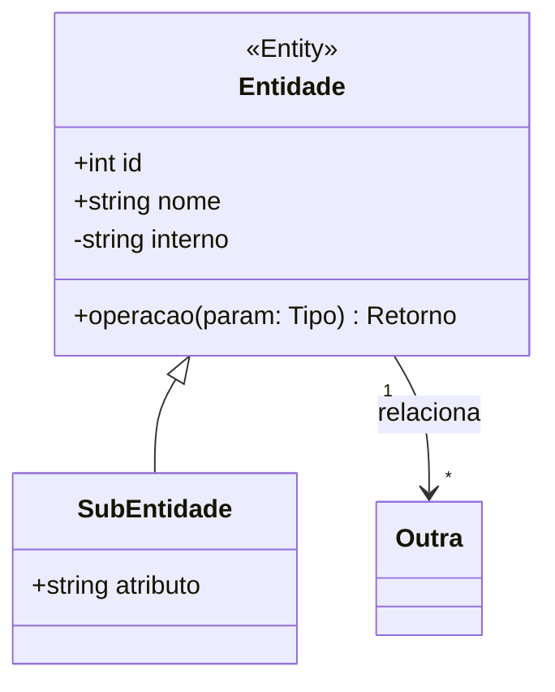

# Modelagem UML — Convenções do Projeto

Este documento define as convenções para escrever e manter diagramas de classe usando Mermaid no GitHub/VS Code.

## Objetivo
- Padronizar a modelagem das entidades e camadas (controllers/serviços) do sistema.
- Facilitar a leitura e revisão durante os ciclos evolutivos.

## Convenções de escrita
- Visibilidade: `+` público, `-` privado, `#` protegido, `~` interno.
- Atributos e métodos dentro do bloco da classe, por exemplo:
  - `+string email`
  - `+login(email, senha) bool` (coloque um espaço antes do tipo de retorno)
- Anotações (estereótipos) em linha separada após a classe para compatibilidade com GitHub:
  - `<<Service>> NomeDaClasse`
  - `<<Controller>> NomeDaClasse`
  - `<<Entity>> NomeDaClasse`
  - `<<Enumeration>> NomeDaClasse`
- Relacionamentos:
  - Herança: `Pai <|-- Filho`
  - Associação: `A --> B : rotulo`
  - Agregação: `A o-- B` | Composição: `A *-- B`
  - Multiplicidades entre aspas: `"1"`, `"*"`, `"1..*"`
- Evite comentários `//` dentro do bloco Mermaid (não são suportados no GitHub). Use notas:
  - `note for Classe "linha1\nlinha2"`

## Padrão de arquivos
- Local: `docs/`
- Nome: `class-diagram-<nome>.md` (minúsculo, hifenizado)
- Um diagrama por arquivo, com um único bloco ```mermaid ... ```

## Template básico



## Quando atualizar
- Ao criar/alterar entidades, controllers, serviços ou relações importantes.
- Ao mudar o schema (Prisma) que impacte o domínio.
- Antes de abrir PR: inclua ajustes de diagrama se houver impacto.

## Checklist (rápido)
- [ ] Anotações em linhas separadas (`<<...>> Classe`)
- [ ] Sem `//` dentro do Mermaid
- [ ] Herança e multiplicidade corretas
- [ ] Nome do arquivo padronizado em `docs/`

## Diagramas existentes
- Admin/CEO: [`docs/class-diagram-admin-ceo.md`](./class-diagram-admin-ceo.md)
- Cliente: [`docs/class-diagram-cliente.md`](./class-diagram-cliente.md)
- Fornecedor: [`docs/class-diagram-fornecedor.md`](./class-diagram-fornecedor.md)
- Material: [`docs/class-diagram-material.md`](./class-diagram-material.md)
- Pedido: [`docs/class-diagram-pedido.md`](./class-diagram-pedido.md)
- Usuario: [`docs/class-diagram-usuario.md`](./class-diagram-usuario.md)
- Avançado (exemplo consolidado): [`docs/class-diagram-avancado.md`](./class-diagram-avancado.md)
