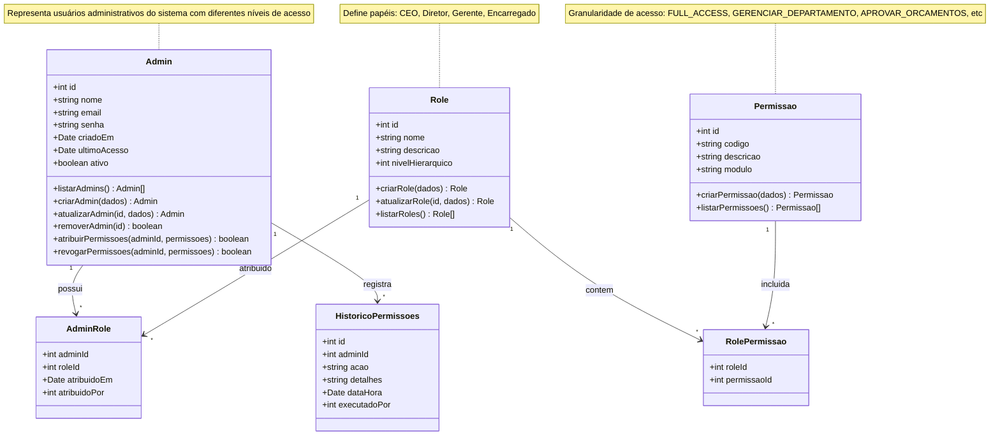

# Diagrama de Classe: Admin (CEO)

> Diagrama completo da estrutura RBAC (Role-Based Access Control) do painel administrativo, incluindo relacionamentos entre Admin, Roles, Permissões e histórico de alterações.
