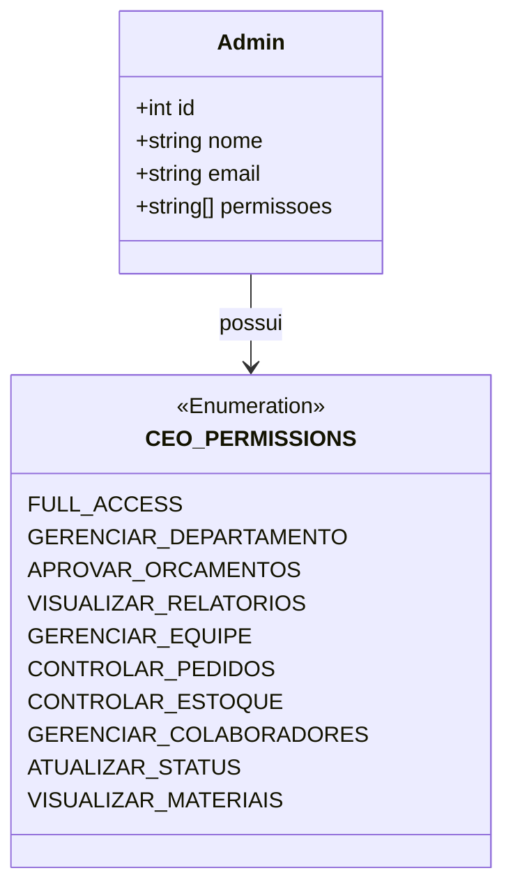

# Diagrama de Classe: Admin (CEO)

```mermaid
classDiagram
    class Admin {
        +int id
        +string nome
        +string email
        +string[] permissoes
    }
    class CEO_PERMISSIONS {
        <<Enumeration>>
        FULL_ACCESS
        GERENCIAR_DEPARTAMENTO
        APROVAR_ORCAMENTOS
        VISUALIZAR_RELATORIOS
        GERENCIAR_EQUIPE
        CONTROLAR_PEDIDOS
        CONTROLAR_ESTOQUE
        GERENCIAR_COLABORADORES
        ATUALIZAR_STATUS
        VISUALIZAR_MATERIAIS
    }
    Admin --> CEO_PERMISSIONS : possui
```

> Este diagrama representa a estrutura do objeto Admin (CEO) e suas permissões principais conforme implementado no controller.
