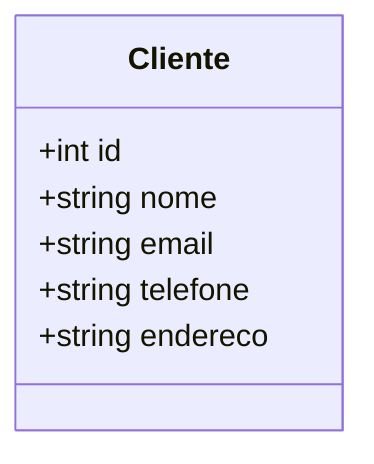

# Diagrama de Classe: Cliente

```mermaid
classDiagram
    class Cliente {
        +int id
        +string nome
        +string email
        +string telefone
        +string endereco
    }
```

> Estrutura básica do modelo Cliente conforme o código fonte.