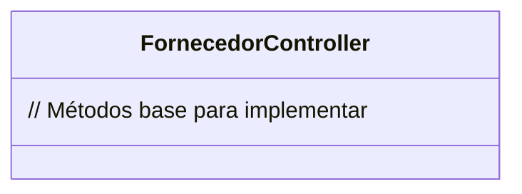

# Diagrama de Classe: Fornecedor

```mermaid
classDiagram
    class FornecedorController {
        // Métodos base para implementar
    }
```

> Estrutura do controller Fornecedor. Adicione atributos e métodos conforme evoluir o código.