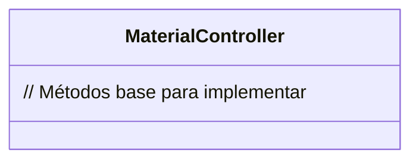

# Diagrama de Classe: Material

```mermaid
classDiagram
    class MaterialController {
        // Métodos base para implementar
    }
```

> Estrutura do controller Material. Adicione atributos e métodos conforme evoluir o código.