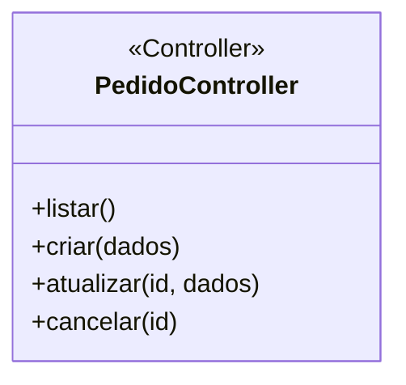

# Diagrama de Classe: Pedido

```mermaid
classDiagram
    class PedidoController {
        <<Controller>>
        +listar()
        +criar(dados)
        +atualizar(id, dados)
        +cancelar(id)
    }
```

> Estrutura do controller Pedido. Adicione atributos e métodos conforme evoluir o código.