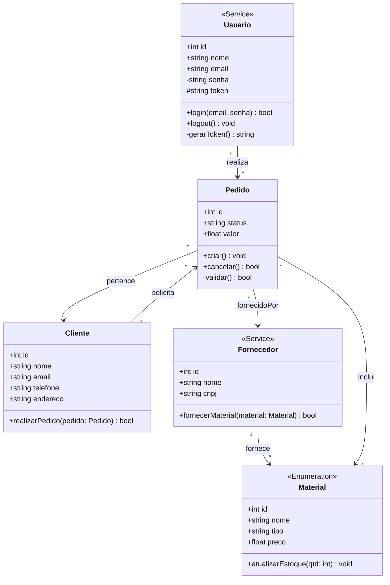

# Diagrama de Classe Super Avançado

```mermaid
classDiagram
    class Usuario {
        +int id
        +string nome
        +string email
        -string senha
        #string token
        +login(email, senha) bool
        +logout() void
        -gerarToken() string
    }
    class Cliente {
        +int id
        +string nome
        +string email
        +string telefone
        +string endereco
        +realizarPedido(pedido: Pedido) bool
    }
    class Pedido {
        +int id
        +string status
        +float valor
        +criar() void
        +cancelar() bool
        -validar() bool
    }
    class Fornecedor {
        +int id
        +string nome
        +string cnpj
        +fornecerMaterial(material: Material) bool
    }
    class Material {
        +int id
        +string nome
        +string tipo
        +float preco
        +atualizarEstoque(qtd: int) void
    }
    Usuario "1" --> "*" Pedido : realiza
    Cliente "1" --> "*" Pedido : solicita
    Pedido "*" --> "1" Cliente : pertence
    Pedido "*" --> "1" Fornecedor : fornecidoPor
    Fornecedor "1" --> "*" Material : fornece
    Pedido "*" --> "*" Material : inclui
    class Usuario <<Service>>
    class Fornecedor <<Service>>
    class Material <<Enumeration>>
```

> Exemplo avançado: visibilidade, métodos, relacionamentos, anotações e multiplicidade.