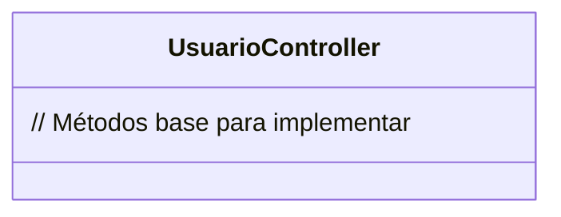

# Diagrama de Classe: Usuario

```mermaid
classDiagram
    class UsuarioController {
        // Métodos base para implementar
    }
```

> Estrutura do controller Usuario. Adicione atributos e métodos conforme evoluir o código.